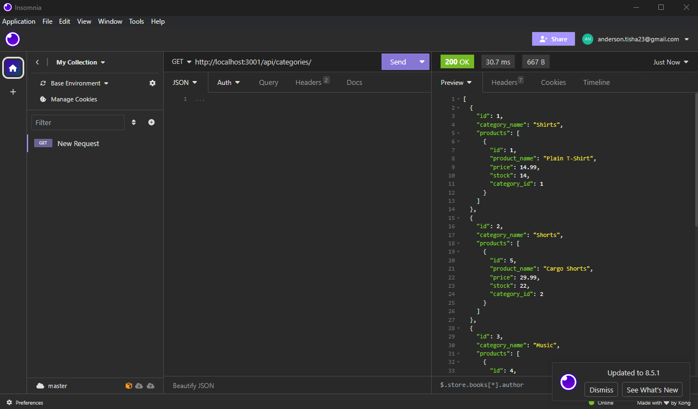
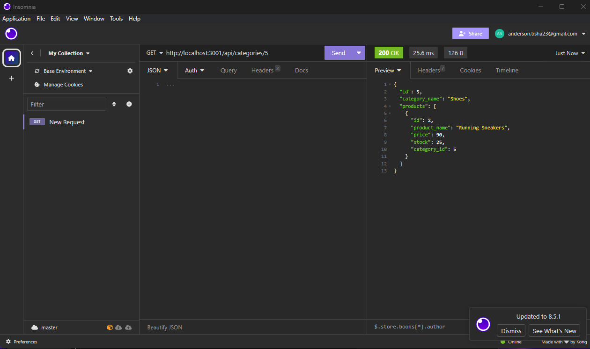
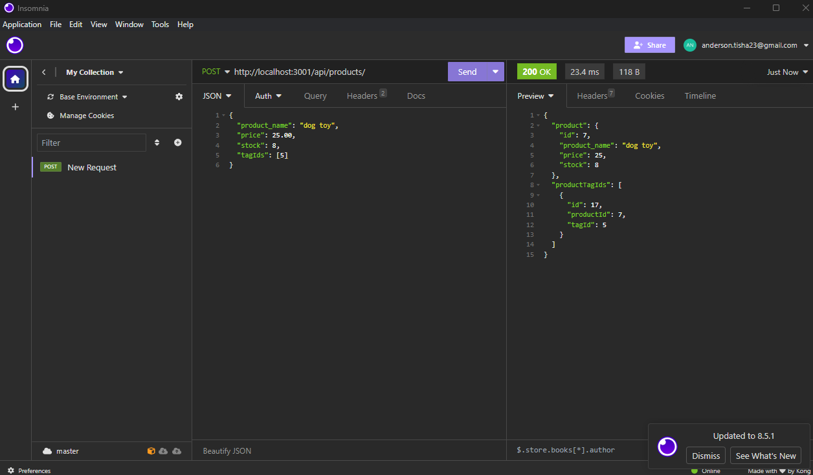
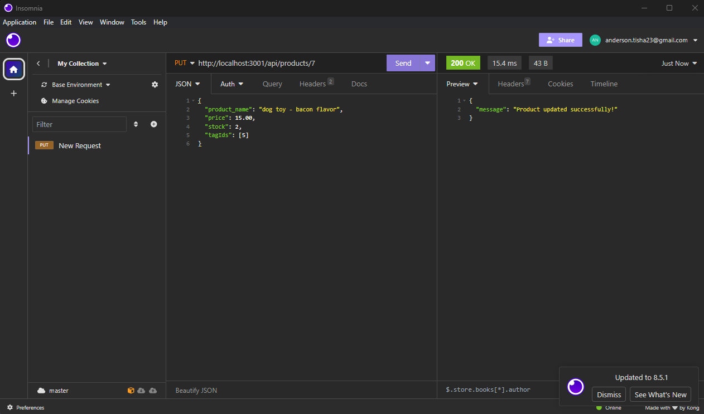

# E-mindYa-Bizzz-Solutions (Module #13 Challenge)

## Table of Contents

- [Description](#description)
- [Installation](#installation)
- [Usage](#usage)
- [Test Sample](#test-sample)
- [Credits](#credits)
- [License](#license)

## Description

Internet retail, also known as **e-commerce**, plays a significant role within the electronics industry, as it empowers businesses and consumers alike to conveniently engage in online buying and selling of electronic products. In the latest available data from 2021, the industry in the United States alone was estimated to have generated the substantial amount of US$2.54 trillion, according to the United Nations Conference on Trade and Development. E-commerce platforms like Shopify and WooCommerce provide a suite of services to businesses of all sizes. Due to the prevalence of these platforms, developers should understand the fundamental architecture of e-commerce sites.

The goal of this project is to build the back end for an e-commerce site by modifying starter code. You’ll configure a working Express.js API to use Sequelize to interact with a MySQL database.

``````
AS A manager at an internet retail company
I WANT a back end for my e-commerce website that uses the latest technologies
SO THAT my company can compete with other e-commerce companies
``````

## Installation

You’ll need to use the [MySQL2](https://www.npmjs.com/package/mysql2) and [Sequelize](https://www.npmjs.com/package/sequelize) packages to connect your Express.js API to a MySQL database and the [dotenv](https://www.npmjs.com/package/dotenv) package to use environment variables to store sensitive data.

Use the `schema.sql` file in the `db` folder to create your database with MySQL shell commands. Use environment variables to store sensitive data like your MySQL username, password, and database name.

#### Database Models

Your database should contain the following four models, including the requirements listed for each model:

* `Category`
  * `id`
    * Integer.  
    * Doesn't allow null values.  
    * Set as primary key.  
    * Uses auto increment.
  * `category_name`  
    * String.  
    * Doesn't allow null values.
* `Product`
  * `id`  
    * Integer.  
    * Doesn't allow null values.  
    * Set as primary key.  
    * Uses auto increment.
  * `product_name`  
    * String.  
    * Doesn't allow null values.
  * `price`  
    * Decimal.  
    * Doesn't allow null values.  
    * Validates that the value is a decimal.
  * `stock`  
    * Integer.  
    * Doesn't allow null values.  
    * Set a default value of `10`.  
    * Validates that the value is numeric.
  * `category_id`  
    * Integer.  
    * References the `Category` model's `id`.
* `Tag`
  * `id`  
    * Integer.  
    * Doesn't allow null values.  
    * Set as primary key.  
    * Uses auto increment.
  * `tag_name`  
    * String.
* `ProductTag`
  * `id`
    * Integer.
    * Doesn't allow null values.
    * Set as primary key.
    * Uses auto increment.
  * `product_id`
    * Integer.
    * References the `Product` model's `id`.
  * `tag_id`
    * Integer.
    * References the `Tag` model's `id`.
#### Associations

You'll need to execute association methods on your Sequelize models to create the following relationships between them:

* `Product` belongs to `Category`, and `Category` has many `Product` models, as a category can have multiple products but a product can only belong to one category.

* `Product` belongs to many `Tag` models, and `Tag` belongs to many `Product` models. Allow products to have multiple tags and tags to have many products by using the `ProductTag` through model.

> **Hint:** Make sure you set up foreign key relationships that match the column created in the respective models.

#### Seed the Database

After creating the models and routes, run `npm run seed` to seed data to your database so that you can test your routes.

#### Sync Sequelize to the Database on Server Start

You will also want your `server.js` to sync the Sequelize models to the MySQL database on server start.

## Usage

Once completed, you will be able to control the entire back end of your system and keep track of inventory better.

#### GET ALL:

Your GET routes will return all categories, all products, and all tags when using Insomnia.



#### GET BY ID:

Your GET routes will return a single category, a single product, and a single tag when using Insomnia.




You will also be able to use your POST, PUT, and DELETE routes to create, update, and delete either categories, products or tags when using Insomnia.

#### POST:


#### PUT:


#### DELETE:


### Test Sample


### Credits

[MySQL2](https://www.npmjs.com/package/mysql2)

[Sequelize](https://www.npmjs.com/package/sequelize)

[Insomnnia](https://insomnia.rest/)

[SMU Bootcamp Activities Module 13](https://techbootcamps.smu.edu/coding/landing-ftpt-b5a/?s=Google-Brand_Tier-1_&dki=Learn%20Coding%20and%20More%20Online&pkw=smu%20coding%20bootcamp&pcrid=454243062435&pmt=e&utm_source=google&utm_medium=cpc&utm_campaign=GGL%7CSMU%7CSEM%7CCODING%7C-%7COFL%7CTIER-1%7CALL%7CBRD%7CEXACT%7CCore%7CBootcamp&utm_term=smu%20coding%20bootcamp&s=google&k=smu%20coding%20bootcamp&utm_adgroupid=104873073054&utm_locationphysicalms=9026987&utm_matchtype=e&utm_network=g&utm_device=c&utm_content=454243062435&utm_placement=&gad_source=1&gclid=CjwKCAiAmZGrBhAnEiwAo9qHiRoAl-bNZ7GAouKuJ0JlnPSvLdiSbMlkquyCHKF7YMPzkpyL2pH2wBoCyb0QAvD_BwE&gclsrc=aw.ds)

[Dotenv](https://www.npmjs.com/package/dotenv)

### License

[](https://opensource.org/licenses/MIT)